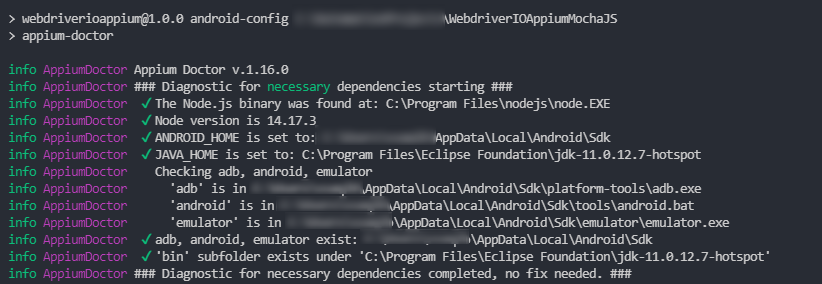

#### Install Appium Server
```
npm install -g appium               [ install appium CLI version ]
npm install -g appium-doctor        [ install appium doctor ]
appium --version                    [ To check appium version ]
```

#### Verify drivers
```
appium driver list                  [ To check available drivers ]
appium driver install uiautomator2  [ install android driver]
appium driver install xcuitest      [ install ios driver]
```

#### Setup Android SDK path environment variable
```
- ANDROID_HOME = <path to Sdk folder>
- %ANDROID_HOME%\tools [path variable]
- %ANDROID_HOME%\tools\bin  [path variable]
- %ANDROID_HOME%\platform-tools  [path variable]
```

#### Setup/Create virtual device on Android studio:
```
1] Open Android Studio
2] Click on More Actions 
   --> AVD Manager 
   --> Create Virtual Device 
   --> Select the device and OS version [ Refer Device Configurations ] 
   --> Finish
3] Once Virtual device is created, click on Launch this AVD in the emulator.
4] Command to view the list of devices attached `adb devices`
```

Device Configurations:
```
Device 1: Pixel 3 - version 11
```


#### Verify all setup
```
appium-doctor --android        [ To check Android set up ]
appium-doctor --ios            [ To check ios set up ]
```
all options should be green checked as shown in below image to start.



##### Allure

The Allure Reporter creates [Allure](https://docs.qameta.io/allure/) test reports which is an HTML generated website with all necessary information to debug your test results and take a look on error screenshots. Add allure to the reporters array in config file and define the output directory of the allure reports.

To generate and view an Allure report inside your corp network or locally, run `npm run allure-report`. The Allure report is hosted on a `web server` and can be accessed through http://YourMachineIP:5050/ and also generated locally which can be found at `./allure-report/index.html`.

Project Structure
   app/android/: Contains the Android .apk file.
   config/: Configuration files for WebdriverIO and capabilities.
   features/: Cucumber feature files.
   pages/: Page Object Model (POM) classes.
   static/: Constants and path constants.
   stepDefinitions/: Cucumber step definitions.
   test-results/: Directory for test results and reports.
Scripts
   npm test: Runs the tests using WebdriverIO and Cucumber.
   npm run allure-report: Generates the Allure report from test results.
   npm run allure.history: Prepares history for Allure report.